# Fireline

[](https://www.apache.org/licenses/LICENSE-2.0)
[](https://github.com/gurdasnijor/fireline/actions/workflows/fireline-cli.yml)
[](docs/guide/README.md)
[](https://github.com/gurdasnijor/fireline/stargazers)

<picture>
  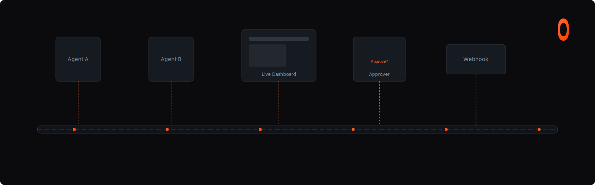
</picture>

**Durable execution for AI agents.**

Every session, prompt, tool call, and approval is a row on one append-only event stream. That single architectural choice gives you four capabilities out of one substrate:

- **Durable execution** — pause an agent inline for hours; resume from any process after crashes, restarts, or host moves.
- **One eventually-consistent view across every agent** — a reactive DB materializes prompts, approvals, and peer hops from the stream, giving you live dashboards and resumable sessions with **zero changes to the agent code**.
- **Composable off-the-shelf agents** — drop in `pi-acp`, the Claude Agent SDK, or Codex over ACP, then compose behavior through a conductor + middleware + proxy architecture you control.
- **Instant local → remote handoff** — run locally, deploy anywhere, or teleport a running session by `sessionId` alone — no context loss, no bespoke checkpointing.

[Guides](docs/guide/README.md) · [Architecture](docs/architecture.md) · [North-star demo](docs/demos/pi-acp-to-openclaw.md) · [Examples](examples/)

---

## Build a team chat room for agents in ~40 lines

Collaborate with a *team* of AI agents in one durable conversation — planner, reviewer, coder — with live typing indicators, inline tool-call visibility, approval cards in the chat, peer handoffs as threaded replies, and every message visible to every viewer in real time.

Normal stacks ship this as a whole product: a gateway, a message bus, a websocket server, session-keeping, telemetry adapters, custom state sync. ([OpenClaw](https://github.com/openclaw/openclaw) is a good reference for the scope.) In Fireline it's two files.

**1. Define the team.**

```typescript
// team.ts
import { agent, compose, middleware, peer as peers, sandbox } from '@fireline/client'
import { trace, approve, peer } from '@fireline/client/middleware'

const worker = (name: string) =>
  compose(
    sandbox(),
    middleware([trace(), approve({ scope: 'tool_calls' }), peer()]),
    agent(['npx', '-y', '@agentclientprotocol/claude-agent-acp']),
  ).as(name)

export default peers(worker('planner'), worker('reviewer'), worker('coder'))
```

**2. Render the chat room.**

```tsx
// ChatRoom.tsx
import { useLiveQuery } from '@tanstack/react-db'
import { eq } from '@tanstack/db'
import fireline from '@fireline/client'

const db = await fireline.db({ stateStreamUrl })

export function ChatRoom({ team }) {
  // Shared feed: every turn, every speaker, threaded by peer handoff.
  const feed = useLiveQuery((q) =>
    q.from({ t: db.promptTurns })
      .leftJoin({ s: db.sessions },          ({ t, s }) => eq(t.sessionId, s.sessionId))
      .leftJoin({ e: db.childSessionEdges }, ({ s, e }) => eq(s.sessionId, e.childSessionId))
      .select(({ t, s, e }) => ({
        from:   s.agentName ?? 'you',
        via:    e?.parentAgentName,          // planner → reviewer threading
        text:   t.text,
        tool:   t.toolName,                  // "reviewer is calling read_file..."
        typing: t.state === 'active',
        at:     t.startedAt,
      }))
      .orderBy(({ t }) => t.startedAt)
  )

  // Pending approvals render inline; any viewer can resolve them.
  const approvals = useLiveQuery((q) =>
    q.from({ p: db.permissions }).where(({ p }) => eq(p.state, 'pending'))
  )

  return (
    <Timeline
      messages={feed}
      approvals={approvals}
      onSend={(text)  => team.planner.prompt(text)}
      onApprove={(id, ok) => team.planner.resolvePermission(id, ok)}
    />
  )
}
```

**What you just built, for free:**

| Feature | How it came for free |
|---|---|
| Shared transcript across 3 agents | One join across `promptTurns × sessions × childSessionEdges` |
| Typing indicators | `t.state === 'active'` on the same row |
| "Reviewer is calling `read_file`…" | `t.toolName` on the same row |
| Planner → Reviewer threaded replies | `childSessionEdges.parentAgentName` |
| Inline approval cards anyone can resolve | `db.permissions` subscription + `resolvePermission()` |
| Close the tab, come back tomorrow, same room | Queries rebuild from the stream on reconnect |
| Open from your phone and see the same conversation | Any client on the stream URL gets the same view |

**Layer in more features — each is one line:**

```typescript
// @-mention filter
.where(({ s }) => eq(s.agentName, mentionedAgent))

// Full-text search across everything the team has ever said
.where(({ t }) => like(t.text, `%${query}%`))

// DM a specific agent instead of broadcasting to the planner
team.reviewer.prompt(text)

// Broadcast to the whole team
await Promise.all(Object.values(team).map((a) => a.prompt(text)))

// Thread view — only turns descended from one root request
.where(({ t }) => eq(t.parentRequestId, rootRequestId))
```

**Why this is the demo.** Two files. Two live queries. Every hard thing — multi-agent coordination, live presence, crash-safe sessions, cross-device sync, inline approvals, lineage threading — came from subscribing to one durable stream. You didn't build a gateway, a message bus, or a session-keeping layer. That's what *durable execution + eventually-consistent reactive state + composable agents* gives you, rendered as a product anyone can demo in 30 seconds.

---

## Pause overnight. Resume from anywhere.

Your agent hits a risky tool call at 11pm. A human needs to approve it before it runs. Normal frameworks force one of three bad choices:

1. **Keep the process alive all night** — expensive, fragile, one restart kills the conversation.
2. **Heartbeat + in-memory state + reload-from-DB** — you now own a liveness system, a checkpoint loop, and a rehydrate path for every tool call that might pause.
3. **Hard-code approval into the prompt** — the model routes around it.

The Fireline version:

```typescript
import { workflowContext } from '@fireline/client'

const ctx = workflowContext({ stateStreamUrl })

const approval = ctx.awakeable<{ approved: boolean }>({
  kind: 'tool', sessionId, toolCallId,
})
await notifySlack(approvalCard, { resumeKey: approval.key })

const { approved } = await approval.promise  // hours later, different host
if (!approved) throw new Error('denied')
```

**What just happened.** The process can die. The laptop can close. The cloud container can recycle. When the human approves 9 hours later — from Slack, from a mobile app, from a webhook handler — `resolveAwakeable(key, { approved: true })` writes one row to the stream. A *different* process, potentially on a *different host*, rehydrates the session and continues at exactly the line after `await approval.promise`. The pending approval is visible in the reactive DB the whole time via `db.permissions.subscribe(...)`.

**No heartbeat. No liveness loop. No bespoke checkpointing.** One canonical key on one durable stream. Durable promises and durable subscribers share the same substrate, so approvals, webhooks, Telegram delivery, and peer handoffs are all the same primitive under different profiles.

See [Awakeables](docs/guide/awakeables.md) · [Durable subscribers](docs/guide/durable-subscriber.md) · [Approvals](docs/guide/approvals.md).

---

## What else this unlocks

**Teleport a live session between hosts.** Start an agent locally. Chat for an hour. Deploy the same spec to k8s. Connect from your phone by `sessionId` alone — full transcript, in-flight approvals, tool call history, all there. No checkpointing API was called. The new process rebuilt everything from the stream.

**Resume a crashed long-running task.** A 90-minute codegen task dies at 14,832 tokens, step 9 of 12, with 2 approvals already granted. Bring up a new host, attach by `sessionId`, and the stream replays: the `budget()` middleware already knows you're at 14,832 tokens, the approvals are already resolved, execution resumes at step 10. You didn't write resume code — the stream was always the truth.

---

## Three primitives, one substrate

Anthropic's [Managed Agents](https://www.anthropic.com/engineering/managed-agents) post names three primitives worth decoupling: the **session** (the append-only log), the **harness** (the loop that calls the model), and the **sandbox** (where it runs). Fireline is the concrete substrate for all three — with a durable stream as the spine connecting them.

<table>
  <tr>
    <td valign="top" width="33%" align="center">
      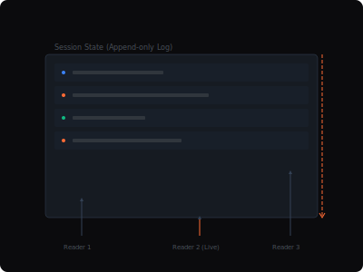
      <br>
      <strong>Session</strong><br>
      The append-only log of everything that happened.
    </td>
    <td valign="top" width="33%" align="center">
      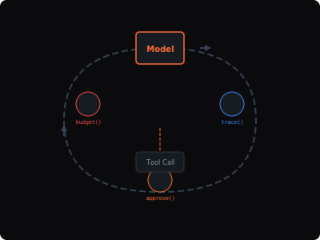
      <br>
      <strong>Harness</strong><br>
      The loop that calls the model and routes its tool calls.
    </td>
    <td valign="top" width="33%" align="center">
      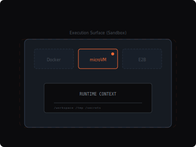
      <br>
      <strong>Sandbox</strong><br>
      The execution environment where the model runs code and edits files.
    </td>
  </tr>
</table>

Each capability below is one of these three, made concrete.

### Session — the append-only log

<table>
  <tr>
    <td valign="top" width="50%">
      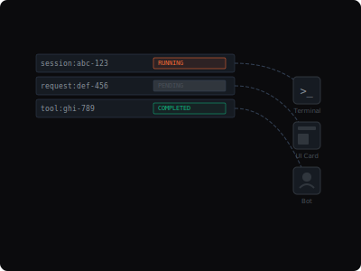
      <br>
      <strong>Globally addressable state</strong><br>
      Every session, request, and tool call has a canonical ID any host can reach.
      <br>
      <a href="docs/guide/observation.md">Observation guide →</a>
    </td>
    <td valign="top" width="50%">
      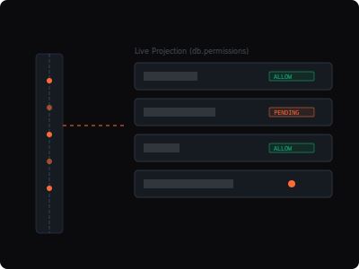
      <br>
      <strong>Live observation</strong><br>
      Subscribe to materialized collections instead of polling the sandbox.
      <br>
      <a href="docs/guide/observation.md">Observation guide →</a>
    </td>
  </tr>
</table>

### Harness — the loop and its edges

<table>
  <tr>
    <td valign="top" width="33%">
      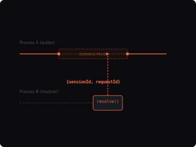
      <br>
      <strong>Durable promises</strong><br>
      Pause a workflow inline for hours; resume from any process.
      <br>
      <a href="docs/guide/awakeables.md">Awakeables guide →</a>
    </td>
    <td valign="top" width="33%">
      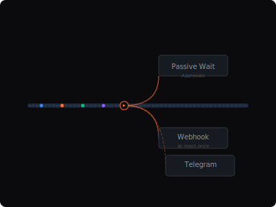
      <br>
      <strong>Durable subscribers</strong><br>
      One substrate for approvals, webhooks, Telegram, and peer delivery.
      <br>
      <a href="docs/guide/durable-subscriber.md">Subscriber guide →</a>
    </td>
    <td valign="top" width="33%">
      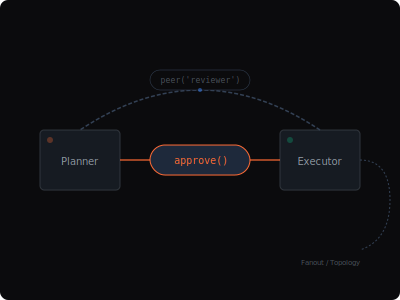
      <br>
      <strong>Composable topologies</strong><br>
      Middleware <em>is</em> the edges between agents — serializable, server-interpreted.
      <br>
      <a href="docs/guide/multi-agent.md">Multi-agent guide →</a>
    </td>
  </tr>
</table>

### Sandbox — where the model runs

<table>
  <tr>
    <td valign="top" width="50%">
      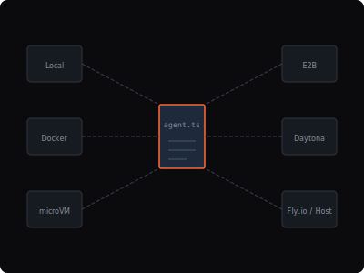
      <br>
      <strong>Any substrate, same spec</strong><br>
      Local, Docker, microVM, E2B, Daytona, or remote — one file runs anywhere.
      <br>
      <a href="docs/proposals/sandbox-provider-model.md">Provider model →</a>
    </td>
    <td valign="top" width="50%">
      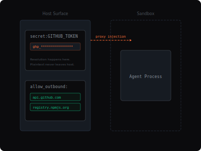
      <br>
      <strong>Resources without leakage</strong><br>
      Secrets injected host-side; resources mounted from durable streams.
      <br>
      <a href="docs/guide/resources.md">Resources guide →</a>
    </td>
  </tr>
</table>

---

## The architecture in one picture

<picture>
  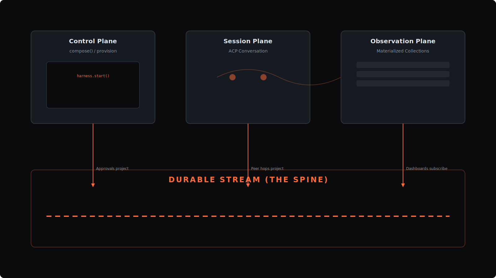
</picture>

Fireline splits agent systems into three planes on one durable spine:

- **Control** — define a serializable harness with `compose(...)`, provision it anywhere.
- **Session** — talk to the running agent over ACP.
- **Observation** — treat the durable stream as the source of truth and materialize it into live, queryable state.

Approvals rebuild from the stream. Peer hops project into the stream. Webhooks advance cursors on the stream. Dashboards subscribe to the stream. **The architecture does not have a "runtime-local" concept for things that matter.**

The deeper crate map, proposal links, and verification notes live in [docs/architecture.md](docs/architecture.md).

---

## The spec is just data

```typescript
import { compose, agent, sandbox, middleware } from '@fireline/client'
import { approve, budget, peer, trace, webhook } from '@fireline/client/middleware'
import { localPath } from '@fireline/client/resources'

export default compose(
  sandbox({ resources: [localPath('.', '/workspace')] }),
  middleware([
    trace(),
    approve({ scope: 'tool_calls' }),
    budget({ tokens: 2_000_000 }),
    peer({ peers: ['reviewer'] }),
    webhook({
      url: 'https://example.com/fireline/approvals',
      events: ['permission_request'],
      keyBy: 'session_request',
    }),
  ]),
  agent(['npx', '-y', '@agentclientprotocol/claude-agent-acp']),
)
```

Every middleware here is **serializable data**, not a userland closure. The TypeScript client builds JSON-shaped specs; a Rust conductor interprets them server-side. The same spec boots locally, ships in an OCI image, or runs on a hosted fleet — no behavior lives in a JS callback that can't cross the wire.

This is the same shape used in [docs/demos/assets/agent.ts](docs/demos/assets/agent.ts).

---

## Any substrate, same spec

Provider selection is a background decision. Fireline ships with a `SandboxProvider` trait (see the [provider model proposal](docs/proposals/sandbox-provider-model.md)) and auto-selects a healthy one at run time — exactly the pattern [Cased sandboxes](https://github.com/cased/sandboxes?tab=readme-ov-file#setup-e2b---alternative) popularized for Python.

```bash
# Just run it. Provider auto-selected (local subprocess by default).
npx fireline run agent.ts

# Override the substrate with an env var — no spec changes.
SANDBOX_PROVIDER=microsandbox npx fireline run agent.ts
SANDBOX_PROVIDER=e2b         E2B_API_KEY=...     npx fireline run agent.ts
SANDBOX_PROVIDER=daytona     DAYTONA_API_KEY=... npx fireline run agent.ts
```

Or declare the preferred provider inline and keep it portable:

```typescript
export default compose(
  sandbox({ provider: 'e2b' }),           // or 'microsandbox' | 'docker' | 'daytona' | 'remote'
  middleware([trace(), approve({ scope: 'tool_calls' })]),
  agent(['npx', '-y', '@anthropic-ai/claude-code-acp']),
)
```

| Provider | Substrate | Capabilities |
|---|---|---|
| `local` | host subprocess | fast boot, file transfer, stream resources |
| `docker` | OCI container | reproducible images, file transfer |
| `microsandbox` | hardware microVM | hardware isolation, OCI, snapshots |
| `e2b` | E2B sandbox | OCI, file transfer, streaming |
| `daytona` | Daytona workspace | OCI, file transfer, streaming |
| `remote` | another Fireline host | cross-host provisioning via durable discovery |

The state stream stays the spine no matter which provider is chosen. A local dashboard subscribing to the stream today can subscribe to the same deployed stream tomorrow. Approvals, awakeables, peer hops, and materialized collections do not know — or care — whether the sandbox is on your laptop, in a microVM, in E2B, or on another Fireline host.

See [CLI guide](docs/guide/cli.md), [Providers guide](docs/guide/providers.md), and the [provider model proposal](docs/proposals/sandbox-provider-model.md).

---

## Why it's different

| Compared to | Good at | Where Fireline fits |
|---|---|---|
| **LangChain / CrewAI / Mastra** | Authoring agent logic, chains, tool use, memory | Fireline is the **runtime substrate** beneath: durable state, canonical identity, observation, guardrails, and operator surfaces — for agents written in any framework, over ACP. |
| **Anthropic Managed Agents** | Zero-ops Claude-native hosting | Fireline is the fit when you want self-hosting, provider portability, model flexibility, multi-agent topologies, or your own middleware and UI surface. |
| **Temporal / Restate** | Durable workflow engines for business code | Fireline applies the same durable-execution shape **natively to the ACP agent protocol** — approvals, tool calls, peer hops, and observation all project onto one durable stream. |
| **Claude API directly** | Fastest path to a model call | Fireline is for the moment your agent needs tools, approvals, dashboards, multi-agent routing, or resume-after-crash. |

---

## Features

<table>
  <tr>
    <td valign="top" width="50%">
      
      <br>
      <strong>Middleware as infrastructure</strong><br>
      Compose <code>trace()</code>, <code>approve()</code>, <code>budget()</code>, <code>peer()</code>, <code>webhook()</code>, <code>telegram()</code>, <code>secretsProxy()</code> as infrastructure rules the agent cannot route around. Serializable. Server-interpreted.
      <br>
      <a href="docs/guide/middleware.md">Middleware guide</a>
    </td>
    <td valign="top" width="50%">
      
      <br>
      <strong>Secrets isolation</strong><br>
      Credential injection without handing plaintext tokens to the agent. Host-side resolution, call-time injection, optional outbound domain allow-lists.
      <br>
      <a href="docs/guide/middleware.md">Middleware guide</a> · <a href="docs/proposals/secrets-injection-component.md">Design</a>
    </td>
  </tr>
  <tr>
    <td valign="top" width="50%">
      
      <br>
      <strong>Durable approvals</strong><br>
      Pause risky tool calls, render the decision in a dashboard or bot, and resume the same session after the approval lands — across restarts and host moves.
      <br>
      <a href="docs/guide/approvals.md">Approvals guide</a>
    </td>
    <td valign="top" width="50%">
      
      <br>
      <strong>Multi-agent mesh</strong><br>
      Planner, reviewer, and helper agents on one shared discovery surface. Lineage, trace context, and child-session edges preserved across peer hops — no log stitching.
      <br>
      <a href="docs/guide/multi-agent.md">Multi-agent guide</a>
    </td>
  </tr>
  <tr>
    <td valign="top" colspan="2">
      
      <br>
      <strong>Durable waits</strong><br>
      Keep long human pauses and external completions on the stream instead of in a process-local callback. Approval gates and <a href="docs/guide/awakeables.md">awakeables</a> share the same canonical completion-key substrate.
      <br>
      <a href="docs/guide/durable-subscriber.md">Durable subscriber guide</a> · <a href="docs/guide/awakeables.md">Awakeables guide</a>
    </td>
  </tr>
</table>

---

## Quick Start

> Prerequisites: **Node 20+** and **Rust stable** (`rustup` — [install here](https://rustup.rs)).

**1. Clone and bootstrap** — one-time, installs workspace deps and builds the native binaries.

```bash
git clone https://github.com/gurdasnijor/fireline.git
cd fireline
pnpm bootstrap
```

**2. Write an agent spec.**

```typescript
// my-agent.ts
import { agent, compose, middleware, sandbox } from '@fireline/client'
import { approve, trace } from '@fireline/client/middleware'
import { localPath } from '@fireline/client/resources'

export default compose(
  sandbox({ resources: [localPath('.', '/workspace')] }),
  middleware([trace(), approve({ scope: 'tool_calls' })]),
  agent(['npx', '-y', '@anthropic-ai/claude-code-acp']),
)
```

**3. Run it.**

```bash
pnpm fireline run my-agent.ts --repl
```

That's the full loop: the CLI loads the spec, provisions the sandbox, launches the agent, and attaches an interactive REPL. Zero env vars, one `import` namespace.

<details>
<summary><strong>Other scripts</strong></summary>

| Command | Purpose |
|---|---|
| `pnpm bootstrap` | Idempotent first-run setup — install JS deps + build native binaries. Safe to rerun after `git pull`. |
| `pnpm build:native` | Just the Rust side (`cargo build --release` for the three binaries) |
| `pnpm build` | Build all TypeScript workspace packages |
| `pnpm fireline run <spec.ts>` | Run any spec through the CLI |
| `pnpm demo` | Skip writing a spec — runs the canonical demo at [`docs/demos/assets/agent.ts`](docs/demos/assets/agent.ts) with the REPL attached. Auto-bootstraps on first run. |

When `@fireline/cli` is published to npm, steps 1 and 3 collapse to `npx @fireline/cli run my-agent.ts --repl` — the bootstrap step goes away because the platform package (`@fireline/cli-<platform>`) ships prebuilt binaries.
</details>

Full walkthrough in the [5-minute Quickstart](docs/guide/guides/quickstart.md).

---

## Examples

| Example | Pattern | What it shows |
|---|---|---|
| [`examples/code-review-agent/`](examples/code-review-agent/) | Scoped code access | `compose` + `approve` + `secretsProxy` + reactive observation of pending approvals |
| [`examples/approval-workflow/`](examples/approval-workflow/) | Durable approvals | `FirelineAgent.resolvePermission()` + stream-backed approval checkpoints |
| [`examples/background-task/`](examples/background-task/) | Fire-and-forget | Provision, prompt, observe completion via stream subscription |
| [`examples/live-monitoring/`](examples/live-monitoring/) | Reactive dashboard | `useLiveQuery` across `sessions`, `promptTurns`, `permissions`, `chunks` |
| [`examples/multi-agent-team/`](examples/multi-agent-team/) | Multi-agent | `pipe(...)` plus shared-state observation across a team |
| [`examples/crash-proof-agent/`](examples/crash-proof-agent/) | Session resume | `stateStream` + `session/load` after sandbox death |
| [`examples/cross-host-discovery/`](examples/cross-host-discovery/) | Discovery | Two control planes, shared discovery stream, peer MCP routing |
| [`examples/flamecast-client/`](examples/flamecast-client/) | Platform client | Dashboard UI over `fireline.db` |

---

## Built On

- [**durable-streams**](https://durablestreams.com) — append-only, replayable event streams
- [**ACP**](https://agentclientprotocol.com) — agent ↔ host communication
- [**sacp-conductor**](https://github.com/agentclientprotocol/rust-sdk) — Rust ACP conductor and middleware pipeline
- [**microsandbox**](https://github.com/superradcompany/microsandbox) — hardware-isolated microVM sandboxes
- [**TanStack DB**](https://tanstack.com/db) — reactive queries over materialized state

---

## License

Apache 2.0. See the [Apache 2.0 license](https://www.apache.org/licenses/LICENSE-2.0).
