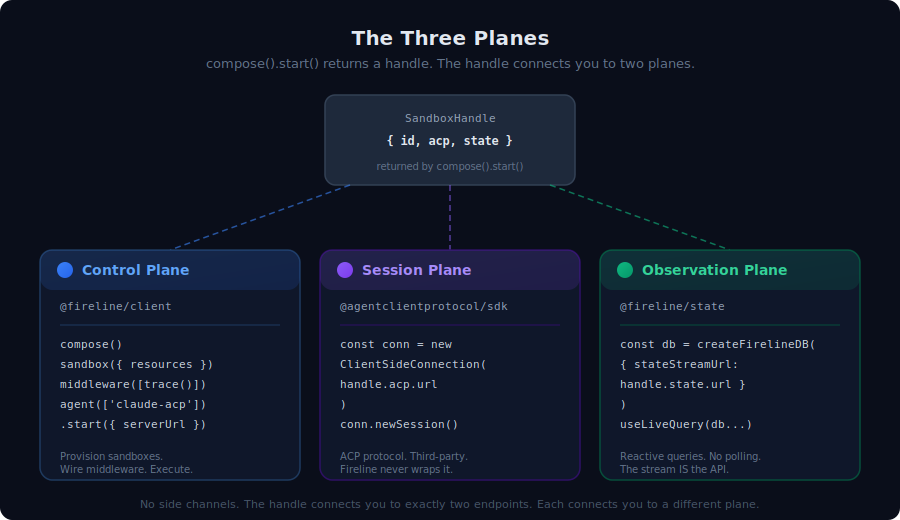
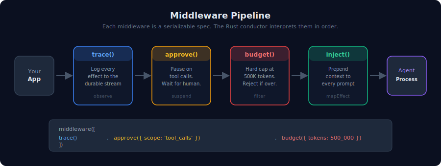
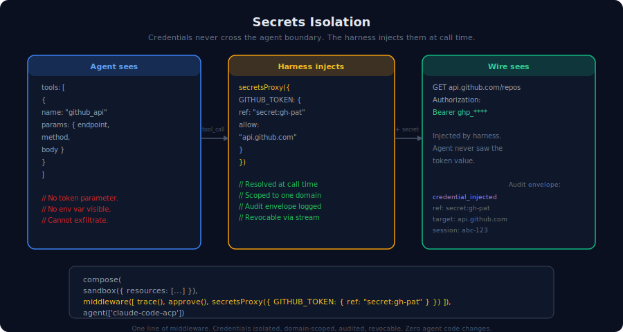
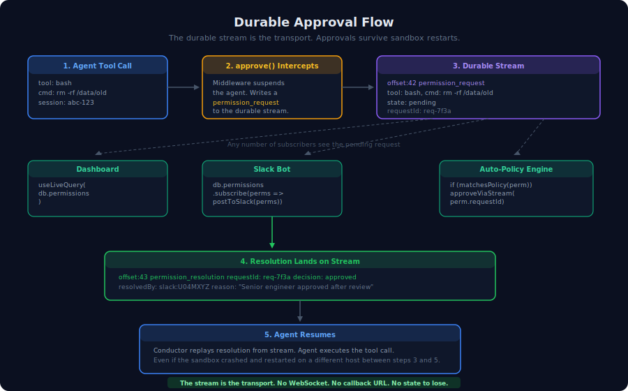
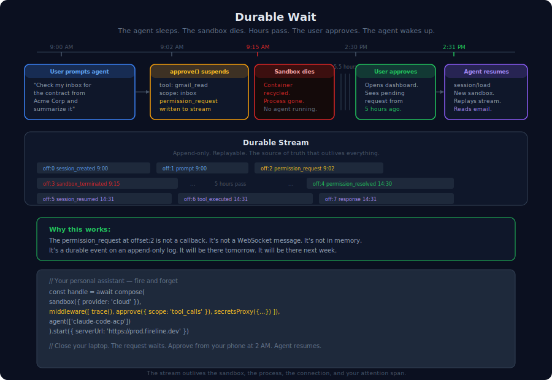
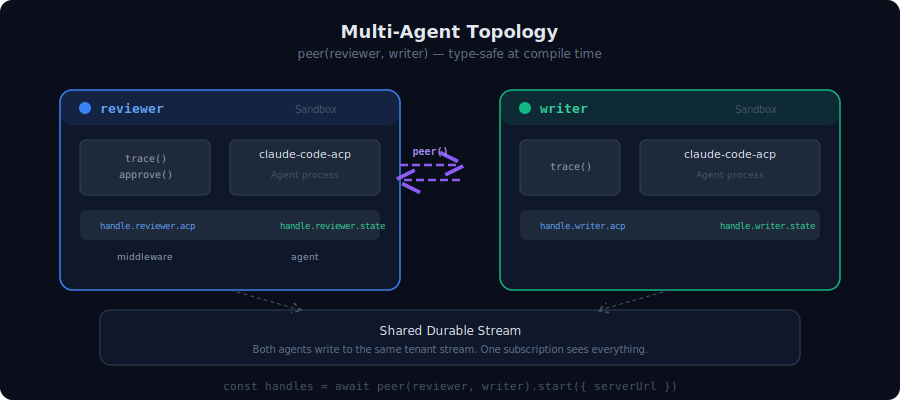

# Fireline

Open-source infrastructure for durable, composable AI agents.

```typescript
// agent.ts
import { agent, compose, middleware, sandbox } from '@fireline/client'
import { approve, budget, trace } from '@fireline/client/middleware'
import { localPath } from '@fireline/client/resources'

export default compose(
  sandbox({ resources: [localPath('.', '/workspace')] }),
  middleware([trace(), approve({ scope: 'tool_calls' }), budget({ tokens: 500_000 })]),
  agent(['npx', '-y', '@anthropic-ai/claude-code-acp']),
)
```

```bash
npx fireline run agent.ts
#   ✓ fireline ready
#     sandbox: runtime:59f5ed5a-d624-…
#     ACP:     ws://127.0.0.1:54896/acp
#     state:   http://127.0.0.1:7474/v1/stream/fireline-state-runtime-…
```

Connect any ACP client to the printed URL. See the [`@fireline/cli` guide](docs/guide/cli.md).

---

## What makes Fireline different

**Durable.** Sessions survive sandbox death. The [durable stream](https://durablestreams.com) is the source of truth, not any single process. Kill a sandbox, restart on a different host, run `session/load` — the conversation continues from exactly where it left off. Every ACP effect lands in an append-only log with idempotent writes and offset replay.

**Composable.** Middleware intercepts the ACP channel declaratively. `trace()`, `approve()`, `budget()`, `inject()` — each is a serializable spec, not a closure. The Rust conductor interprets them server-side. Compose them like Express middleware, ship them as data, validate them before deployment.

**Observable.** `fireline.db()` from `@fireline/client` gives you reactive queries over the agent's durable stream. No polling. `useLiveQuery()` in React, `.subscribe()` in Node. The stream IS the observation API — sessions, turns, chunks, permissions, cross-agent lineage, all materialized by [TanStack DB](https://tanstack.com/db) with differential dataflow.

**Portable.** Same `compose()` call runs on a local subprocess, in a Docker container, on a [microsandbox](https://github.com/superradcompany/microsandbox) VM, or on a remote Fireline server. Swap the `serverUrl`, keep everything else. The agent code doesn't know or care where it's running.

---

## Quick start

Two paths — declarative (recommended) and imperative.

### Declarative: `@fireline/cli`

```typescript
// agent.ts — the whole agent definition, 10 lines
import { agent, compose, middleware, sandbox } from '@fireline/client'
import { approve, budget, trace } from '@fireline/client/middleware'
import { localPath } from '@fireline/client/resources'

export default compose(
  sandbox({ resources: [localPath('.', '/workspace')] }),
  middleware([trace(), approve({ scope: 'tool_calls' }), budget({ tokens: 500_000 })]),
  agent(['npx', '-y', '@anthropic-ai/claude-code-acp']),
)
```

```bash
npx fireline run agent.ts
```

The `@fireline/cli` package boots durable streams in-process, spawns the control plane,
provisions the sandbox, and prints the ACP endpoint for any
[ACP client](https://agentclientprotocol.com/get-started/clients) to
connect. See the [CLI guide](docs/guide/cli.md).

### Imperative: `FirelineAgent` from code

```typescript
import fireline, { agent as agentProcess, compose, connectAcp, middleware, sandbox } from '@fireline/client'
import { approve, budget, trace } from '@fireline/client/middleware'
import { localPath } from '@fireline/client/resources'

const reviewer = await compose(
  sandbox({ resources: [localPath('.', '/workspace')] }),
  middleware([trace(), approve({ scope: 'tool_calls' }), budget({ tokens: 500_000 })]),
  agentProcess(['npx', '-y', '@anthropic-ai/claude-code-acp']),
).start({ serverUrl: 'http://127.0.0.1:4440' })

// The live FirelineAgent object:
const acp = await reviewer.connect()               // open an ACP session
const db = await fireline.db({ stateStreamUrl: reviewer.state.url })
const pending = db.permissions.toArray.find((row) => row.state === 'pending')
if (pending) {
  await reviewer.resolvePermission(pending.sessionId, pending.requestId, {
    allow: true,
    resolvedBy: 'policy-engine',
  })
}
const inspector = await connectAcp(reviewer.acp, 'reviewer-ui') // standalone helper
await inspector.close()
await acp.close()
db.close()
await reviewer.stop()
```

Either way, the agent runs in an isolated sandbox, every tool call
requires approval, every effect lands on a durable stream you can
replay, query, or pipe into a dashboard. Kill the sandbox, restart it
on a different machine — the session continues from where it left off.

See [examples/](examples/) — code review, background task runner, live
monitoring, multi-agent team, crash-proof agent, approval workflow.

---

<picture>
  
</picture>

## The three planes

| Plane | Package | What it does |
|---|---|---|
| **Control** | `@fireline/client` | `compose(sandbox, middleware, agent).start()` returns a `FirelineAgent` with `.connect()`, `.resolvePermission()`, `.stop()` |
| **Session** | `@agentclientprotocol/sdk` | ACP over `agent.acp.url` — `newSession()`, `prompt()`, `loadSession()`. Third-party protocol; Fireline never wraps it. |
| **Observation** | `@fireline/client` | `await fireline.db({ stateStreamUrl: agent.state.url })` → `db.sessions`, `db.permissions`, `useLiveQuery()` — reactive TanStack DB collections over the durable stream |

`FirelineAgent` carries two endpoints (`acp`, `state`). Each connects you
to a different plane. No side channels.

---

<picture>
  
</picture>

## Middleware

An ordered list of ACP interceptors. Each is a serializable spec — data, not a closure. The Rust conductor interprets them server-side.

```typescript
import { middleware } from '@fireline/client'
import { approve, budget, inject, peer, secretsProxy, trace } from '@fireline/client/middleware'

const chain = middleware([
  trace(),                              // Log every ACP effect to the durable stream
  approve({ scope: 'tool_calls' }),     // Require approval before tool execution
  budget({ tokens: 1_000_000 }),        // Hard token budget cap
  inject([                              // Prepend context to every prompt
    { kind: 'workspaceFile', path: '/workspace/README.md' },
    { kind: 'datetime' },
  ]),
  peer({ peers: ['agent:reviewer', 'agent:writer'] }),
  secretsProxy({
    OPENAI_API_KEY: { ref: 'env:OPENAI_API_KEY', allow: 'api.openai.com' },
  }),
])
```

Middleware composes. Add `peer({ peers: ['agent:reviewer'] })` to route cross-agent calls. Add `secretsProxy({ OPENAI_API_KEY: { ref: 'env:OPENAI_API_KEY', allow: 'api.openai.com' } })` to isolate credentials. The conductor processes them in order on every ACP message.

---

<picture>
  
</picture>

## Secrets isolation — credentials the agent can't see

Agents need API keys to do useful work. But if the agent can see the key, it can exfiltrate it. Fireline's `secretsProxy()` middleware injects credentials at call time, scoped to specific domains, without ever exposing the plaintext to the agent.

```typescript
import { agent, compose, middleware, sandbox } from '@fireline/client'
import { approve, secretsProxy, trace } from '@fireline/client/middleware'
import { localPath } from '@fireline/client/resources'

const reviewer = await compose(
  sandbox({
    provider: 'docker',
    resources: [localPath('.', '/workspace')],
  }),
  middleware([
    trace(),
    approve({ scope: 'tool_calls' }),
    secretsProxy({
      GITHUB_TOKEN:      { ref: 'secret:gh-pat', allow: 'api.github.com' },
      ANTHROPIC_API_KEY: { ref: 'env:ANTHROPIC_API_KEY' },
    }),
  ]),
  agent(['npx', '-y', '@anthropic-ai/claude-code-acp']),
).start({ serverUrl: 'http://127.0.0.1:4440' })
```

The agent sees tool schemas without credential parameters. The harness resolves `CredentialRef`s from your secret store (env vars in dev, vault in production), injects them into outbound requests for the allowed domain, and emits an audit envelope to the durable stream — all without the agent ever touching a plaintext token.

→ *Technical deep-dive:* [`docs/proposals/secrets-injection-component.md`](docs/proposals/secrets-injection-component.md)

---

## Observe everything — reactively, from the stream

Every agent effect lands on a durable stream. `fireline.db()` materializes it into reactive collections you query like a database — no polling, no custom APIs.

```tsx
import fireline, { type FirelineAgent, type SessionId } from '@fireline/client'
import { useLiveQuery } from '@tanstack/react-db'
import { eq } from '@tanstack/db'

declare const reviewer: FirelineAgent

const db = await fireline.db({ stateStreamUrl: reviewer.state.url })

// React component — re-renders automatically as the agent works
function AgentActivity({ sessionId }: { sessionId: SessionId }) {
  const turns = useLiveQuery((q) =>
    q.from({ t: db.promptTurns })
      .where(({ t }) => eq(t.sessionId, sessionId)),
    [db, sessionId],
  )
  const pending = useLiveQuery((q) =>
    q.from({ p: db.permissions })
      .where(({ p }) => eq(p.state, 'pending')),
    [db],
  )
  return <pre>{JSON.stringify({ turns: turns.data?.length ?? 0, pendingApprovals: pending.data?.length ?? 0 }, null, 2)}</pre>
}
```

The stream contains sessions, turns, chunks, tool calls, permissions, cross-agent lineage — all queryable in real-time. Build a dashboard, wire up a Slack notification, trigger a webhook — the stream is the API.

---

## Durable orchestration — subscribe, don't poll

Need to know when an agent finishes? When it needs approval? When a multi-step pipeline advances? Subscribe to the stream. The durable log IS the orchestration mechanism.

```typescript
import fireline, { type FirelineAgent, type SessionId } from '@fireline/client'

declare const reviewer: FirelineAgent
declare const sessionId: SessionId

const db = await fireline.db({ stateStreamUrl: reviewer.state.url })

// Wait for agent completion — durably, without holding a connection open
db.promptTurns.subscribe((turns) => {
  const done = turns.find((turn) => turn.sessionId === sessionId && turn.state === 'completed')
  if (done) {
    console.log(done.text ?? 'prompt completed')
  }
})

// Auto-approve tool calls matching a policy — the approval gate is a stream event
db.permissions.subscribe((perms) => {
  for (const permission of perms.filter((row) => row.state === 'pending')) {
    void reviewer.resolvePermission(permission.sessionId, permission.requestId, {
      allow: true,
      resolvedBy: 'policy-engine',
    })
  }
})

// React to cross-agent handoffs
db.childSessionEdges.subscribe((edges) => {
  console.log(`cross-agent handoffs: ${edges.length}`)
})
```

No `whileLoop()` orchestrator. No `wake()` verb. No polling. The durable stream pushes events to you. If your process crashes and restarts, replay from the last offset — nothing is lost.

---

<picture>
  
</picture>

## Durable approval gates — approvals that survive everything

The agent calls a dangerous tool. The `approve()` middleware suspends the agent and writes a `permission_request` to the durable stream. Any subscriber — a dashboard, a Slack bot, an automated policy engine — can resolve it. The resolution lands on the stream. The conductor replays it and the agent resumes.

The key insight: the durable stream is the transport. There's no callback URL to expire, no WebSocket to drop, no in-memory state to lose. If the sandbox crashes between the request and the resolution, restart it anywhere — the approval is already on the stream, waiting to be replayed.

```typescript
import fireline, { type FirelineAgent } from '@fireline/client'

declare const reviewer: FirelineAgent

const db = await fireline.db({ stateStreamUrl: reviewer.state.url })

// Auto-approve safe operations, escalate dangerous ones to Slack
db.permissions.subscribe((perms) => {
  for (const permission of perms.filter((row) => row.state === 'pending')) {
    if ((permission.title ?? '').includes('read-only')) {
      void reviewer.resolvePermission(permission.sessionId, permission.requestId, {
        allow: true,
        resolvedBy: 'auto-approve',
      })
    } else {
      console.log(`Escalate ${permission.requestId} to Slack`)
    }
  }
})
```

---

## Sessions survive everything

Kill a sandbox. Restart it on a different host. The session continues.

```typescript
import { agent, compose, middleware, sandbox } from '@fireline/client'
import { trace } from '@fireline/client/middleware'

const harness = compose(
  sandbox({ provider: 'docker' }),
  middleware([trace()]),
  agent(['npx', '-y', '@anthropic-ai/claude-code-acp']),
)

// Host A — local dev
const agentA = await harness.start({
  serverUrl: 'http://127.0.0.1:4440',
  name: 'assistant-a',
  stateStream: 'my-session',
})
// ... prompt a few turns, then stop
await agentA.stop()

// Host B — cloud, different machine, different continent
const agentB = await harness.start({
  serverUrl: 'https://prod.internal:4440',
  name: 'assistant-b',
  stateStream: 'my-session',
})
// session/load picks up from exactly where Host A left off
```

The session is the stream, not the sandbox. Both hosts read and write the same durable log. The agent on Host B replays the full conversation history and continues. Zero state is lost.

---

<picture>
  
</picture>

## Durable waits — approvals that outlive everything

Your personal assistant agent is running in the cloud. You ask it to check your inbox. The `approve()` middleware pauses the agent and writes a `permission_request` to the durable stream. You close your laptop and walk away.

The sandbox times out after 15 minutes. The container is recycled. The agent process is gone.

Five hours later, you open the dashboard on your phone. The pending approval is right there — it's a durable stream event, not an in-memory callback. You tap "approve." The resolution lands on the stream. A new sandbox provisions, calls `session/load`, replays the stream, sees the approval, and the agent reads your email and sends you the summary.

```typescript
import { agent, compose, middleware, sandbox } from '@fireline/client'
import { approve, secretsProxy, trace } from '@fireline/client/middleware'

// Fire-and-forget personal assistant
const assistant = await compose(
  sandbox({ provider: 'anthropic' }),
  middleware([
    trace(),
    approve({ scope: 'tool_calls' }),
    secretsProxy({
      GOOGLE_OAUTH_TOKEN: { ref: 'oauth:google' },
    }),
  ]),
  agent(['npx', '-y', '@anthropic-ai/claude-code-acp']),
).start({ serverUrl: 'https://prod.fireline.dev', stateStream: 'inbox-check' })

// Prompt and walk away — the stream remembers everything
const acp = await assistant.connect()
const { sessionId } = await acp.newSession({ cwd: '/workspace', mcpServers: [] })
await acp.prompt({
  sessionId,
  prompt: [{ type: 'text', text: 'Check my inbox for the Acme contract and summarize it' }],
})

// Hours later, from a different device:
// 1. Dashboard shows pending approval (it's a stream event, not a callback)
// 2. You approve via assistant.resolvePermission(...)
// 3. New sandbox provisions, replays stream, agent continues
```

The stream outlives the sandbox, the process, the network connection, and your attention span. That's what durable means.

---

<picture>
  
</picture>

## Multi-agent topologies

```typescript
import { agent, compose, fanout, middleware, peer, sandbox } from '@fireline/client'
import { peer as peerMiddleware, trace } from '@fireline/client/middleware'

const serverUrl = 'http://127.0.0.1:4440'
const worker = (name: string) =>
  compose(
    sandbox({ provider: 'docker' }),
    middleware([trace(), peerMiddleware({ peers: ['reviewer', 'writer'] })]),
    agent(['npx', '-y', '@anthropic-ai/claude-code-acp']),
  ).as(name)

// peer() wires cross-agent ACP calls — type-safe at compile time
const team = await peer(worker('reviewer'), worker('writer')).start({
  serverUrl,
  stateStream: 'team-demo',
})
// team.reviewer and team.writer are each FirelineAgent objects
// Both write to the same durable stream — one subscription sees everything

// fanout() runs N instances in parallel
const workers = await fanout(worker('reviewer'), { count: 3 }).start({
  serverUrl,
  name: 'reviewer',
})
```

---

## Examples

| Example | Pattern | What it shows |
|---|---|---|
| [`examples/code-review-agent/`](examples/code-review-agent/) | Scoped code access | `compose` + `approve` + `secretsProxy` + reactive observation of pending approvals |
| [`examples/approval-workflow/`](examples/approval-workflow/) | Durable approvals | `FirelineAgent.resolvePermission()` + stream-backed approval checkpoints |
| [`examples/background-task/`](examples/background-task/) | Fire-and-forget | Provision, prompt, observe completion via stream subscription |
| [`examples/live-monitoring/`](examples/live-monitoring/) | Reactive dashboard | `useLiveQuery` across `sessions`, `promptTurns`, `permissions`, `chunks` |
| [`examples/multi-agent-team/`](examples/multi-agent-team/) | Multi-agent | `pipe(...)` plus shared-state observation across a team |
| [`examples/crash-proof-agent/`](examples/crash-proof-agent/) | Session resume | `stateStream` + `session/load` after sandbox death |
| [`examples/cross-host-discovery/`](examples/cross-host-discovery/) | Discovery | Two control planes, shared discovery stream, peer MCP routing |
| [`examples/flamecast-client/`](examples/flamecast-client/) | Platform client | Dashboard UI over `fireline.db` |

---

## Architecture

The Rust workspace is organized by [Anthropic's managed-agent primitive taxonomy](https://www.anthropic.com/engineering/managed-agents):

```
crates/
├── fireline-semantics     Pure semantic kernel — session, approval, resume state machines
├── fireline-session        Durable-stream session log, replay, materializer, host index
├── fireline-harness        ACP conductor, middleware pipeline, approval gate, trace projector
├── fireline-sandbox        SandboxProvider trait + LocalSubprocess/Docker/Microsandbox impls
├── fireline-resources      ResourceMounter, FsBackend, resource publisher
├── fireline-tools          Peer registry, MCP tool injection, capability refs
├── fireline-orchestration  Child session edges, orchestration primitives
└── fireline-host           HTTP server, ProviderDispatcher, control plane routes
```

Proposals driving the next phase:

- [`docs/proposals/sandbox-provider-model.md`](docs/proposals/sandbox-provider-model.md) — unified SandboxProvider abstraction
- [`docs/proposals/client-api-redesign.md`](docs/proposals/client-api-redesign.md) — `compose()` client API with typed topologies
- [`docs/proposals/cross-host-discovery.md`](docs/proposals/cross-host-discovery.md) — cross-host agent discovery via durable streams
- [`docs/proposals/resource-discovery.md`](docs/proposals/resource-discovery.md) — stream-backed resource publishing + mounting
- [`docs/proposals/deployment-and-remote-handoff.md`](docs/proposals/deployment-and-remote-handoff.md) — local → cloud migration

**Formally verified.** The semantic kernel is model-checked with [TLA+](verification/spec/managed_agents.tla) and [Stateright](verification/stateright/). Key invariants: `SessionDurableAcrossRuntimeDeath`, `WakeOnReadyIsNoop`, `WakeOnStoppedChangesRuntimeId`, `ConcurrentWakeSingleWinner`, `ResourcePublishedIsEventuallyDiscoverable`.

---

## Built on

- [**durable-streams**](https://durablestreams.com) — the append-only, replayable event stream substrate
- [**ACP**](https://agentclientprotocol.com) — Agent Client Protocol for agent ↔ host communication
- [**sacp-conductor**](https://github.com/agentclientprotocol/rust-sdk) — the Rust ACP conductor + middleware pipeline
- [**microsandbox**](https://github.com/superradcompany/microsandbox) — hardware-isolated microVM sandboxes (optional provider)
- [**TanStack DB**](https://tanstack.com/db) — differential-dataflow reactive queries over materialized state

---

## License

Apache 2.0. See [LICENSE](LICENSE).
