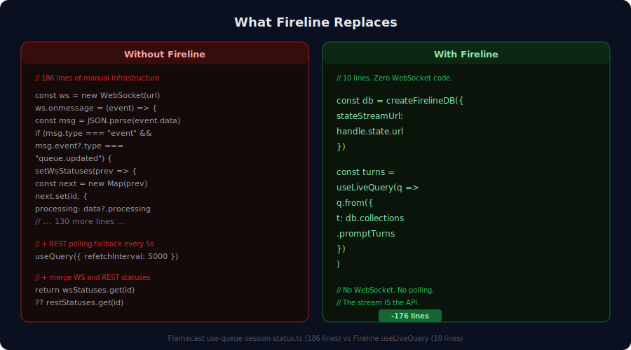

# Fireline — Why it matters

## The problem

You're building AI features into your product. Today you call the Claude API, get a response, show it to the user. It works.

But your users are asking for more. They want agents that can *do* things — browse their codebase, run shell commands, call APIs, write files, interact with databases. And the moment you give an agent tools, you have three new problems that the API alone doesn't solve:

**How do I know what it's doing?** The agent is running commands in a sandbox. It's calling tools you gave it access to. It's making decisions. Right now you find out what happened after the fact, from logs — if you're lucky. You have no real-time visibility into what the agent is doing while it's doing it.

**How do I stop it from doing something bad?** The agent has a shell. It has API keys. It has access to production data. You need guardrails that work at the infrastructure level, not as prompts the agent can ignore. You need approval gates, budget caps, credential isolation — and you need them to be composable, auditable, and impossible to bypass.

**What happens when the process crashes mid-task?** The agent is running a 30-minute code review. The process crashes at minute 20. Do you start over? Do you lose the work? Does the user see an error and give up? Today, most agent setups lose everything. The conversation, the tool call history, the partial results — all gone.

Fireline solves all three.

---

## What Fireline gives you

### Visibility — see everything the agent does, live

Every action the agent takes — every prompt, every tool call, every response, every permission request — is recorded to a durable event stream in real time. Not as logs. As structured, queryable data.

Your frontend subscribes to that stream and gets a live, reactive view of agent activity. Build a dashboard that shows all 50 of your agents working in parallel. Build an alert that fires when an agent requests a dangerous permission. Build an audit trail that satisfies your compliance team. The data is already there — you just query it.

The observation layer works the same way whether the agent is running on a developer's laptop or in a production cluster. One subscription, full visibility, no polling.

### Control — composable guardrails that agents can't bypass

Fireline intercepts every interaction between your application and the agent through a middleware pipeline. Each middleware is a declarative rule — not a prompt, not a suggestion, but an infrastructure-level gate that the agent cannot circumvent.

- *"Require human approval for any tool call"* — one line of configuration. The agent pauses, a permission request appears in your dashboard (or Slack, or webhook), and the agent waits until a human approves or denies.
- *"Cap this agent at 500,000 tokens"* — one line. The middleware enforces the budget at the infrastructure level, not in the prompt.
- *"Prepend this context document to every prompt"* — one line. Every interaction the agent has includes the context you specify, without relying on the agent to remember it.
- *"Route calls to a specialist agent for code changes"* — one line. The middleware intercepts specific requests and routes them to a different agent with different permissions.

These rules compose. Stack them in any order. Add new ones without changing your agent code. Remove them without breaking anything. They're data — auditable, version-controlled, diffable.

### Durability — the agent's work survives everything

The agent's entire conversation history — every prompt, every response, every tool call, every approval — lives in a durable event stream, not in the agent process. If the process crashes, the work is still there. If the host fails over, the work is still there. If you move the agent from your laptop to a cloud server, the work is still there.

Restart the agent on a different machine, point it at the same stream, and it picks up the conversation from exactly where it left off. Not "start over." Not "here's a summary of what happened." The actual conversation, replayed event by event, with full fidelity.

This means your 3am batch job doesn't lose 4 hours of work when a container recycles. Your user's coding session doesn't vanish when they close their laptop and reopen it on their phone. Your multi-step pipeline doesn't restart from step 1 when step 7 fails.

---

## What this looks like in practice

**Your customer support agent gets stuck.** Instead of "something went wrong, try again," your ops team opens a dashboard and sees the agent's full decision trace — what it tried, what failed, where it's waiting. They can approve the stuck permission, inject context, or redirect the agent. The user never knows there was a problem.

**Your code review agent wants to run `rm -rf`.** The middleware pipeline intercepts the tool call, pauses the agent, and sends an approval request to your existing Slack channel. A senior engineer reviews the command, denies it, and the agent gets a structured denial with a reason. This takes 30 seconds and requires zero custom code — the approval gate is a single middleware entry.

**Your data processing agent crashes at 3am.** Your orchestration layer detects the crash (it's a stream event), provisions a new sandbox, and the agent resumes from its last checkpoint in the event stream. Processing continues from minute 20, not minute 0. Your morning report shows the interruption as a blip, not a failure.

**You have 50 agents running in parallel.** One dashboard, powered by a single stream subscription, shows all of them — active sessions, pending approvals, token budgets, completion status. No per-agent polling. No custom WebSocket wiring. The stream carries everything.

**You move your agent from dev to production.** Same agent definition. Same middleware. Same resource mounts. Different server URL. That's the entire migration. Your staging environment and your production environment run the same code — the only difference is where the sandboxes are provisioned and which durable stream they write to.

---

## How it compares

**vs. calling the Claude/OpenAI API directly.** You still use Claude (or any model). Fireline adds the infrastructure *around* the API call — sandboxing, middleware, durability, observability. Think of it as the difference between calling a function and deploying a service: the function is the model call; the service is everything else.

**vs. LangChain, CrewAI, AutoGen.** Those are agent *authoring* frameworks — they help you write the agent's logic: chains, tool definitions, prompt templates. Fireline is agent *deployment* infrastructure — it runs the agent, observes it, controls it, and makes it durable. Use both together: author with LangChain, deploy on Fireline.

**vs. Anthropic's Managed Agents.** Anthropic gives you zero-ops cloud hosting with built-in session management. Fireline gives you the same capabilities — session durability, tool sandboxing, middleware pipelines — self-hosted, with full control over the infrastructure, multi-model support, and composable middleware. You can also use both: Fireline can use Anthropic's managed agents as one of its sandbox providers, alongside local subprocesses, Docker, and hardware-isolated VMs.

---

<picture>
  
</picture>

## Under the hood

For the engineering team that will evaluate the technical foundation:

**Durable event streams.** Every agent effect is appended to a [durable stream](https://durablestreams.com) — an append-only, replayable event log with idempotent writes and producer-scoped deduplication. The stream is the single source of truth. In-memory state is a derived view, rebuilt by replaying the stream. This is what makes sessions crash-proof and host-portable.
→ *Technical deep-dive:* [`docs/proposals/sandbox-provider-model.md`](docs/proposals/sandbox-provider-model.md)

**Middleware pipeline.** Every message between the application and the agent passes through an ordered chain of interceptors — approval gates, budget caps, context injection, audit loggers, peer-call routers. Each interceptor is a declarative spec, serialized as JSON, interpreted by a Rust conductor. No closures, no runtime code injection — the pipeline is data.
→ *Technical deep-dive:* [`docs/proposals/client-api-redesign.md`](docs/proposals/client-api-redesign.md) §4

**Sandbox providers.** The agent runs in an isolated sandbox — a subprocess, a Docker container, or a hardware-isolated microVM. The same agent definition works across all providers. Provisioning, lifecycle management, resource mounting, and teardown are handled by the provider; the application code doesn't change.
→ *Technical deep-dive:* [`docs/proposals/sandbox-provider-model.md`](docs/proposals/sandbox-provider-model.md) §3

**Reactive state observation.** The durable stream feeds a reactive query engine ([TanStack DB](https://tanstack.com/db)) that materializes agent activity into typed, filterable, joinable collections — sessions, conversation turns, tool calls, approval requests, cross-agent call graphs. Frontend components subscribe to live queries that update automatically as the stream advances. Backend services subscribe to the same stream for orchestration, alerting, and webhooks.
→ *Technical deep-dive:* [`packages/state/`](packages/state/)

**Formal verification.** The core state machines — session durability, approval resolution, concurrent wake semantics — are modeled in [TLA+](verification/spec/managed_agents.tla) and checked with [Stateright](verification/stateright/). The invariants we verify include: *"sessions survive sandbox death"*, *"the first approval resolution wins"*, *"concurrent restarts converge to one sandbox."* These aren't aspirational properties — they're checked on every commit.
→ *Technical deep-dive:* [`verification/`](verification/)
