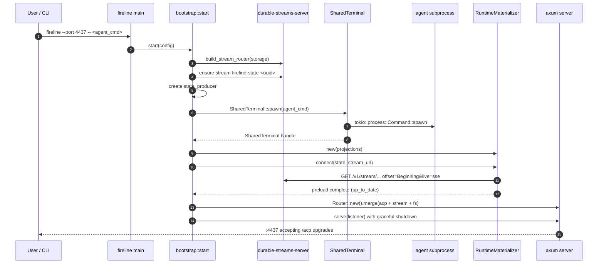
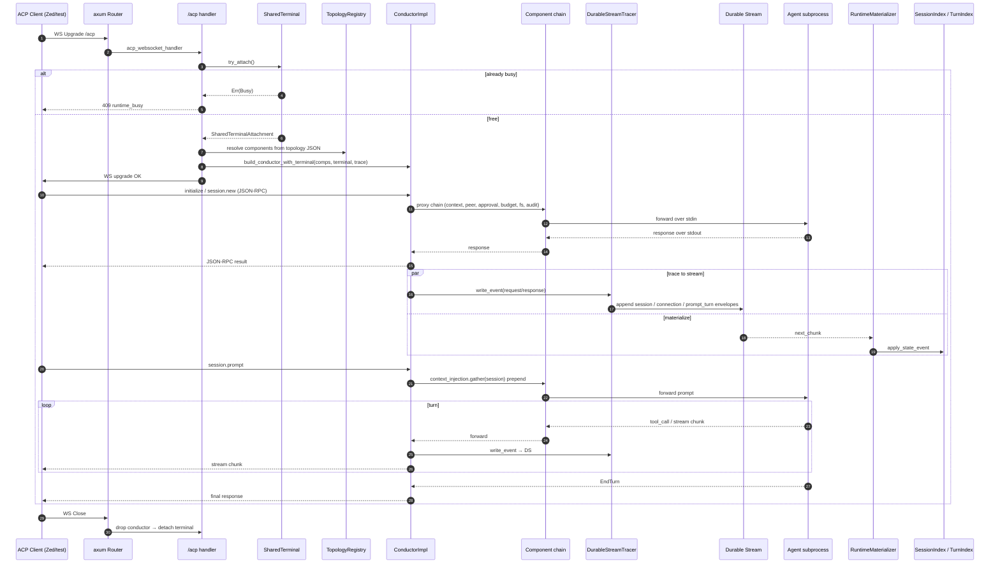
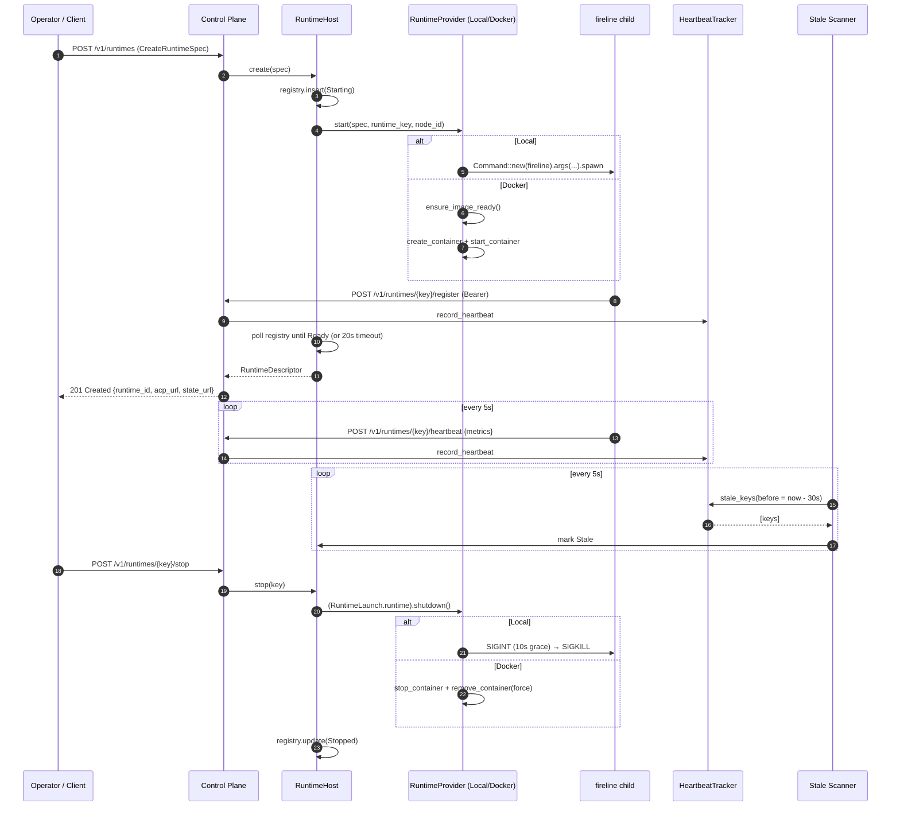
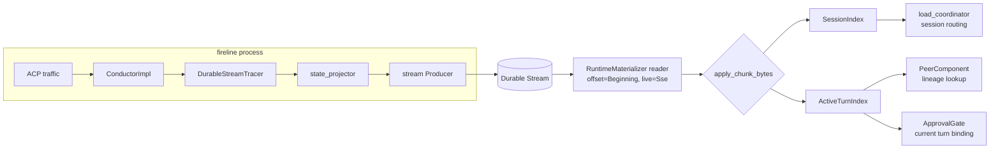
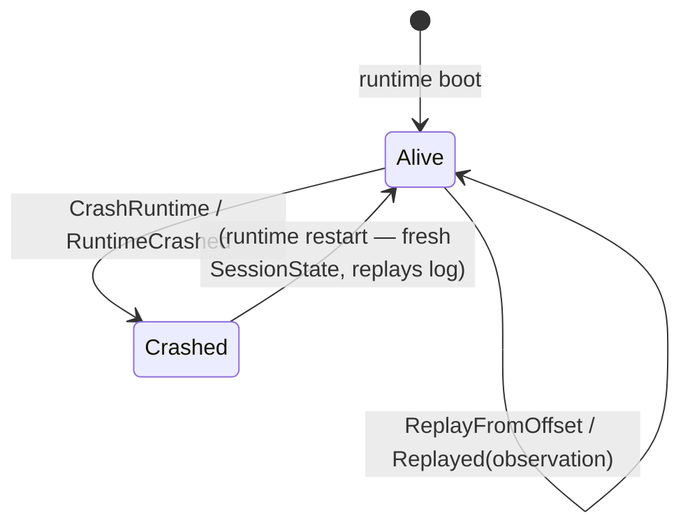
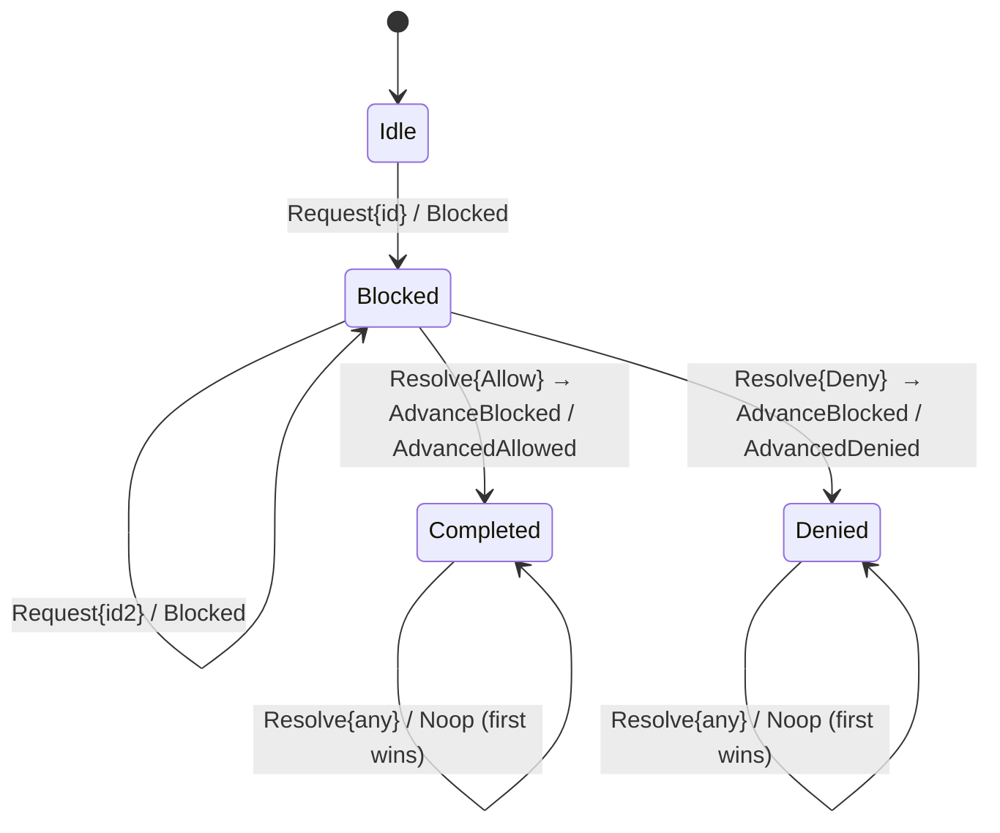
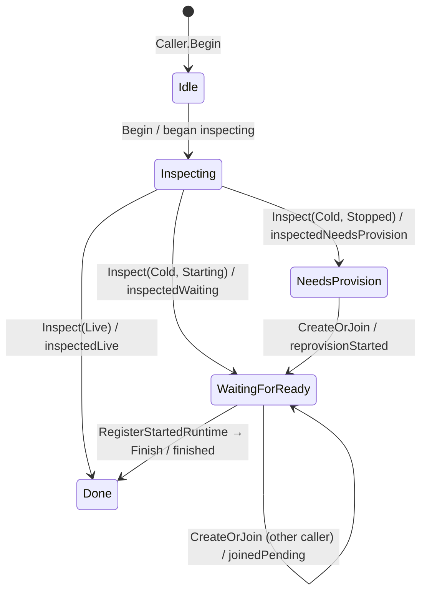

# Fireline Architecture

> A physical + logical map of the Fireline workspace, the trait system that glues components together, the runtime execution model, transports, and activity diagrams covering the key lifecycles.

---

## 0. Executive Summary

Fireline is a **Rust runtime substrate for ACP-compatible agents**. It hosts long-running agent subprocesses, mediates all ACP traffic through a composable proxy chain (the "conductor"), projects every ACP event into a **durable state stream**, and is managed by an HTTP **control plane** that can spawn runtimes as local subprocesses or Docker containers.

The two big architectural ideas:

1. **Durable stream is the source of truth.** Every ACP event is traced into a durable-streams topic. In-memory projections (session index, active turn index) are derived; cold-starts replay from the beginning. This is what enables session resume, peer lineage, and crash recovery.

2. **Everything is a component.** The conductor is a proxy chain of pluggable `ConnectTo<Conductor>` components (peer broker, context injection, approval gate, budget, fs backend, audit tracer…). Topology is JSON-driven and resolved per connection. Runtime providers, peer registries, file backends, context sources, and mounters are all `dyn Trait` behind SPIs.

---

## 1. Physical Map — Workspace Layout

### 1.1 Directory overview

```
fireline/
├── Cargo.toml                   # workspace root + top-level `fireline` binary pkg
├── src/                         # top-level binary crate (multiple bins)
│   ├── main.rs                  # `fireline` — the runtime binary
│   ├── bin/
│   │   ├── dashboard.rs         # `fireline-dashboard` (TUI — stub)
│   │   ├── agents.rs            # `fireline-agents` (catalog CLI — stub)
│   │   ├── testy.rs             # SDK-backed ACP test agent
│   │   ├── testy_load.rs        # resumable test agent (session/load)
│   │   ├── testy_fs.rs          # scripted fs-op emitting test agent
│   │   └── testy_prompt.rs      # echo test agent
│   ├── bootstrap.rs             # runtime wiring: terminal + conductor + server
│   ├── stream_host.rs           # embeds durable-streams-server
│   ├── routes/                  # axum handlers: acp
│   ├── session_index.rs         # in-memory session projection
│   ├── active_turn_index.rs     # in-memory turn projection
│   ├── runtime_materializer.rs  # replays durable stream into projections
│   ├── runtime_host.rs          # runtime descriptor + provider kinds
│   ├── runtime_registry.rs      # TOML-persisted runtime registry
│   ├── runtime_provider.rs      # BootstrapRuntimeLauncher adapter
│   ├── control_plane_client.rs  # push-mode register/heartbeat client
│   ├── control_plane_peer_registry.rs
│   ├── child_session_edge.rs    # parent→child lineage edge writer
│   ├── load_coordinator.rs      # session/load matching
│   ├── orchestration.rs         # resume(sessionId) contract
│   ├── agent_catalog.rs         # ACP registry client
│   ├── topology.rs              # component/tracer registration
│   └── error_codes.rs           # Fireline ACP _meta errors
│
├── crates/
│   ├── fireline-semantics/      # pure state machines (session/approval/resume)
│   ├── fireline-conductor/      # conductor substrate, runtime providers, trace
│   ├── fireline-components/     # proxies/tracers (peer, audit, context, approval,
│   │                            #                 budget, fs_backend, attach_tool,
│   │                            #                 smithery)
│   └── fireline-control-plane/  # HTTP control-plane binary crate
│
├── verification/
│   └── stateright/              # model-checks fireline-semantics
│
├── docker/
│   └── fireline-runtime.Dockerfile
│
├── packages/                    # pnpm TS workspace (NOT runtime; build-time)
│   ├── state/                   # @fireline/state — Zod schema + TanStack helpers
│   ├── client/                  # @fireline/client — browser/node TS client
│   └── browser-harness/         # Vite harness for browser tests
│
├── docs/                        # architecture, execution slices 01-17, state, runtime
├── tests/                       # integration tests (~16 files)
├── states/                      # timestamped state snapshots (debug artifacts)
└── .agents/skills/              # harness-local agent skills scaffolding
```

### 1.2 Workspace members (`Cargo.toml` roots)

| Crate | Kind | Role |
|---|---|---|
| `fireline` (root) | Binary (7 bins) | Runtime host process + CLIs + test agents |
| `fireline-semantics` | Library | **Zero-dep** pure state machines — session / approval / resume kernels |
| `fireline-conductor` | Library | ACP conductor wiring, transports, runtime providers, durable-stream trace writer, topology registry |
| `fireline-components` | Library | Pre-built topology components (proxies + tracers) |
| `fireline-control-plane` | Binary | HTTP runtime lifecycle API (axum, port 4440) |
| `verification/stateright` | Library | Stateright model-checking harness for semantics kernels |

### 1.3 Binaries produced by the root `fireline` crate

| Binary | Purpose | Primary port(s) | Key env / flags |
|---|---|---|---|
| `fireline` | Runtime host (direct or control-plane-managed) | `4437` state, `4438` helper | `FIRELINE_RUNTIME_KEY`, `FIRELINE_NODE_ID`, `FIRELINE_CONTROL_PLANE_URL`, `--topology-json`, `--mounted-resources-json`, trailing agent command |
| `fireline-dashboard` | TUI for state stream (stub) | — | — |
| `fireline-agents` | Agent catalog CLI (stub) | — | — |
| `fireline-testy` | SDK-backed ACP test agent (stdio) | — | — |
| `fireline-testy-load` | Resumable test agent implementing `session/load` | — | `FIRELINE_ADVERTISED_STATE_STREAM_URL` |
| `fireline-testy-fs` | Scripted fs-op test agent (emits `fs/*` on command) | — | — |
| `fireline-testy-prompt` | Echo test agent | — | — |

### 1.4 Control plane binary

The `fireline-control-plane` binary (default `127.0.0.1:4440`) owns a `RuntimeHost` + `RuntimeManager` and exposes a REST API to create, list, inspect, stop, and heartbeat managed runtimes. Provider is selectable (`--provider Local|Docker`).

---

## 2. Internal Dependency Graph

```
                ┌─────────────────────┐
                │  fireline (binary)  │
                └──────────┬──────────┘
                           │  depends on
              ┌────────────┴────────────┐
              ▼                         ▼
   ┌─────────────────────┐   ┌─────────────────────┐
   │ fireline-components │──▶│ fireline-conductor  │
   └─────────────────────┘   └─────────────────────┘
                                       ▲
                                       │
                             ┌─────────┴──────────┐
                             │ fireline-control-  │
                             │      plane         │
                             └────────────────────┘

   ┌──────────────────────┐       ┌───────────────────────┐
   │ verification/        │──────▶│ fireline-semantics    │
   │  stateright          │       │ (zero internal deps)  │
   └──────────────────────┘       └───────────────────────┘
```

Key observations:

- **`fireline-semantics` has zero internal deps** — it is pure, no `tokio`, no `sacp`, no IO. This is what makes it model-checkable.
- **`fireline-conductor` has no internal deps** either — it imports only external crates (tokio, sacp, durable-streams, bollard, …). This makes it the base layer on top of which `fireline-components` and downstream binaries assemble.
- **`fireline-components` depends only on `fireline-conductor`** — it is a pure "component catalog" layer.
- The root `fireline` binary is the only place where the *entire* tree is composed: semantics is **not** imported here because the runtime uses ACP + durable-streams, not the pure kernels directly. The kernels are specifications; runtime behavior happens to conform.

---

## 3. Logical Architecture — Layered View

```
┌───────────────────────────────────────────────────────────────────────┐
│ LAYER 5 — CLIENTS                                                     │
│  TS `@fireline/client`, `@fireline/state`, Zed/Claude/VSCode IDEs,    │
│  `fireline-dashboard` (TUI), integration tests, browser harness       │
└─────────────────────────┬─────────────────────────────────────────────┘
                          │ WebSocket /acp, HTTP /v1/stream/*
                          ▼
┌───────────────────────────────────────────────────────────────────────┐
│ LAYER 4 — CONTROL PLANE (fireline-control-plane, port 4440)           │
│  REST: /v1/runtimes CRUD, /register, /heartbeat                       │
│   ├─ RuntimeHost     (create/stop lifecycle)                          │
│   ├─ RuntimeManager  (provider dispatch)                              │
│   ├─ RuntimeRegistry (persisted TOML)                                 │
│   ├─ HeartbeatTracker + stale scanner                                 │
│   └─ RuntimeTokenStore (bearer tokens)                                │
└─────────────────────────┬─────────────────────────────────────────────┘
                          │ spawn subprocess / create container
                          ▼
┌───────────────────────────────────────────────────────────────────────┐
│ LAYER 3 — FIRELINE RUNTIME (one `fireline` process, ports 4437/38)    │
│                                                                       │
│  ┌──────────────────┐  ┌──────────────────┐  ┌──────────────────┐   │
│  │ axum Router      │  │ embedded         │  │ RuntimeMaterial- │   │
│  │  /acp (WS)       │  │ durable-streams- │  │ izer             │   │
│  │  /healthz        │  │ server           │  │  ├ SessionIndex  │   │
│  │  /v1/stream/*    │  │  (same listener) │  │  └ ActiveTurn    │   │
│  └────────┬─────────┘  └────────┬─────────┘  │    Index         │   │
│           │                     │            └────────▲─────────┘   │
│           │ per-WS:             │ Producer           │ Reader        │
│           │ build ConductorImpl │                    │ (live SSE)    │
│           ▼                     │                    │               │
│  ┌────────────────────────┐     │                    │               │
│  │ ConductorImpl<Agent>   │     │                    │               │
│  │ (sacp proxy chain)     │     │                    │               │
│  └────────┬───────────────┘     │                    │               │
│           │ attach              │                    │               │
│           ▼                     │                    │               │
│  ┌────────────────────────┐     │                    │               │
│  │ SharedTerminal (actor) │     │                    │               │
│  │ — one subprocess/run.  │     │                    │               │
│  └────────┬───────────────┘     │                    │               │
│           │ stdio                                                    │
│           ▼                                                          │
│  ┌────────────────────────┐                                          │
│  │ Agent child process    │                                          │
│  │ (claude-code-acp, …)   │                                          │
│  └────────────────────────┘                                          │
└───────────────────────────────────────────────────────────────────────┘
                                  ▲
                                  │
┌─────────────────────────────────┴─────────────────────────────────────┐
│ LAYER 2 — COMPOSITION (fireline-conductor + fireline-components)      │
│  • topology::TopologyRegistry   (named factories: peer_mcp, audit,    │
│                                   context_injection, budget,          │
│                                   approval_gate, fs_backend, …)       │
│  • build::build_subprocess_conductor / build_conductor_with_terminal  │
│  • trace::DurableStreamTracer, CompositeTraceWriter                   │
│  • transports::{websocket, duplex}                                    │
│  • runtime::{Local, Docker}Provider, RuntimeHost, mounter             │
└───────────────────────────────────────────────────────────────────────┘
                                  ▲
                                  │
┌─────────────────────────────────┴─────────────────────────────────────┐
│ LAYER 1 — SEMANTICS (fireline-semantics, pure)                        │
│  session::{SessionState, SessionAction, apply}                        │
│  approval::{ApprovalState, ApprovalAction, apply}                     │
│  resume::{ResumeState, ResumeAction, apply}                           │
│  → model-checked by verification/stateright                           │
└───────────────────────────────────────────────────────────────────────┘
```

---

## 4. Trait System — The Contracts

The codebase leans hard on trait objects for its SPIs (runtime providers, file backends, peer registries, …) and on generics for type-safe conductor composition. Here's the full inventory.

### 4.1 Runtime lifecycle SPIs (`fireline-conductor::runtime`)

```rust
// provider.rs:312
#[async_trait]
pub trait ManagedRuntime: Send {
    async fn shutdown(self: Box<Self>) -> Result<()>;
}

// provider.rs:316
pub trait RuntimeTokenIssuer: Send + Sync {
    fn issue(&self, runtime_key: &str, ttl: Duration) -> String;
}

// provider.rs:321
#[async_trait]
pub trait RuntimeProvider: Send + Sync {
    fn kind(&self) -> RuntimeProviderKind;
    async fn start(
        &self,
        spec: CreateRuntimeSpec,
        runtime_key: String,
        node_id: String,
    ) -> Result<RuntimeLaunch>;
}

// local.rs:10 — SPI decoupling LocalProvider from the launch mechanism
#[async_trait]
pub trait LocalRuntimeLauncher: Send + Sync {
    async fn start_local_runtime(
        &self,
        spec: CreateRuntimeSpec,
        runtime_key: String,
        node_id: String,
        mounted_resources: Vec<MountedResource>,
    ) -> Result<RuntimeLaunch>;
}

// mounter.rs:19
#[async_trait]
pub trait ResourceMounter: Send + Sync {
    async fn mount(
        &self,
        resource: &ResourceRef,
        runtime_key: &str,
    ) -> Result<Option<MountedResource>>;
}
```

**Implementations**:

| Trait | Impls | Where |
|---|---|---|
| `ManagedRuntime` | `DockerManagedRuntime`, `SpawnedRuntime`, `BootstrapHandle` | `runtime/docker.rs`, `control-plane/local_provider.rs`, `src/runtime_provider.rs` |
| `RuntimeProvider` | `LocalProvider`, `DockerProvider` | `runtime/local.rs`, `runtime/docker.rs` |
| `LocalRuntimeLauncher` | `BootstrapRuntimeLauncher` (in-proc), `ChildProcessRuntimeLauncher` (subprocess) | `src/runtime_provider.rs`, `control-plane/local_provider.rs` |
| `ResourceMounter` | `LocalPathMounter` | `runtime/mounter.rs` |

Key shape: `RuntimeLaunch { runtime: Box<dyn ManagedRuntime>, … }` — the provider hands back an erased runtime handle whose only operation is `shutdown()`.

### 4.2 State projection SPI (`src/runtime_materializer.rs`)

```rust
// runtime_materializer.rs:56
#[async_trait]
pub trait StateProjection: Send + Sync {
    async fn apply_state_event(&self, event: &RawStateEnvelope) -> Result<()>;
    async fn reset(&self) -> Result<()> { Ok(()) }   // default no-op
}
```

Impls: `SessionIndex` (materializes `session` and `runtime_spec` rows) and `ActiveTurnIndex` (materializes `prompt_turn` rows). The materializer holds a `Vec<Arc<dyn StateProjection>>` and fans each chunk out to every projection.

### 4.3 Component SPIs (`fireline-components`)

```rust
// context.rs:51 — pluggable context gathering
#[async_trait]
pub trait ContextSource: Send + Sync {
    async fn gather(&self, session_id: &str) -> Result<String, sacp::Error>;
}
// Impls: DatetimeSource, WorkspaceFileSource, StaticTextSource

// peer/directory.rs:44 — peer discovery
#[async_trait]
pub trait PeerRegistry: Send + Sync {
    async fn list_peers(&self) -> Result<Vec<Peer>>;
    async fn lookup_peer(&self, agent_name: &str) -> Result<Option<Peer>>;
}
// Impls: LocalPeerDirectory (TOML file), ControlPlanePeerRegistry (HTTP)

// peer/lookup.rs:21 — active-turn lookup for peer-call lineage
#[async_trait]
pub trait ActiveTurnLookup: Send + Sync {
    async fn current_turn(&self, session_id: &str) -> Option<ActiveTurnRecord>;
    async fn wait_for_current_turn(
        &self,
        session_id: &str,
        timeout: Duration,
    ) -> Option<ActiveTurnRecord>;
}
// Impls: ActiveTurnIndex (also implements StateProjection)

// peer/lookup.rs:31 — parent→child edge emission
#[async_trait]
pub trait ChildSessionEdgeSink: Send + Sync {
    async fn emit_child_session_edge(&self, edge: ChildSessionEdgeInput) -> Result<()>;
}
// Impls: ChildSessionEdgeWriter (appends to durable stream)

// fs_backend.rs:24 — fs interception
#[async_trait]
pub trait FileBackend: Send + Sync {
    async fn read(&self, path: &Path) -> Result<Vec<u8>>;
    async fn write(&self, path: &Path, content: &[u8]) -> Result<()>;
}
// Impls: LocalFileBackend, RuntimeStreamFileBackend
```

### 4.4 SDK traits implemented by Fireline (`agent-client-protocol` / `sacp`)

The ACP SDK is the *real* extension surface. Two traits matter:

**`ConnectTo<sacp::Conductor>` — the proxy/component interface.** Every Fireline component that sits on the request path implements this. The standard shape is:

```rust
impl ConnectTo<sacp::Conductor> for MyComponent {
    async fn connect_to(self, client: impl ConnectTo<Proxy>) -> Result<(), sacp::Error> {
        sacp::Proxy.builder()
            .name("my-component")
            .on_receive_request_from(Client, async |request, responder, cx| {
                // inspect/mutate/forward
            }, sacp::on_receive_request!())
            .connect_to(client)
            .await
    }
}
```

Impls in Fireline:

| Component | File | What it intercepts |
|---|---|---|
| `PeerComponent` | `components/peer/mod.rs:51` | `session/new` — injects per-session MCP server with peer RPC tools |
| `ContextInjectionComponent` | `components/context.rs:126` | `session/prompt` — prepends/appends gathered context |
| `ApprovalGateComponent` | `components/approval.rs` | Operations matching configured rules → blocks until resolved |
| `BudgetComponent` | `components/budget.rs` | Per-session token / tool-call / duration quotas |
| `FsBackendComponent` | `components/fs_backend.rs:104` | `fs/read_text_file`, `fs/write_text_file` |
| `AttachToolComponent` | `components/attach_tool.rs` | Slice 17 capability profiles / dynamic tool attach |
| `LoadCoordinatorComponent` | `src/load_coordinator.rs` | `session/load` routing |

**`WriteEvent` — the trace observer interface** (from `sacp_conductor::trace`). Implementations receive every request / response / notification on the connection:

| Observer | File | Behavior |
|---|---|---|
| `DurableStreamTracer` | `conductor/trace.rs:99` | Projects ACP events into `session` / `connection` / `prompt_turn` / `runtime_instance` rows via the private `state_projector`; appends to the state stream |
| `AuditTracer` | `components/audit.rs:126` | Filters by method and appends to a separate audit stream |
| `CompositeTraceWriter` | `conductor/trace.rs:36` | Fan-out to `Vec<BoxedTraceWriter>` |
| `NoopTraceWriter` | `src/topology.rs:409` | Test no-op |

### 4.5 Where dispatch is dynamic vs. static

- **`Box<dyn Trait>` / `Arc<dyn Trait>` (dynamic)** is used for every *pluggable extension point*: runtime providers, managed runtimes, mounters, state projections, peer registries, file backends, context sources, trace writers, and proxy components (`DynConnectTo<Conductor>`). These are the SPIs — anything a new deployment or slice might want to swap.
- **Generics (monomorphized)** are used for: transport adapters (`handle_upgrade` takes `ConductorImpl<sacp::Agent>` by value), builder closures (`Fn(Option<&Value>) -> Result<…>` factories), `impl Into<String>`, and the ACP SDK's core `ConnectTo` chain. The wire-format / control-flow skeleton is generic; the extension surface is dyn.

### 4.6 Key enums (state and variant types)

**Runtime lifecycle** (`fireline-conductor/runtime/provider.rs`):

```rust
enum RuntimeProviderKind { Local, Docker }
enum RuntimeStatus { Starting, Ready, Busy, Idle, Stale, Broken, Stopped }
enum StreamStorageMode { Memory, FileFast, FileDurable, Acid }
enum ResourceRef { LocalPath{..}, GitRemote{..}, S3{..}, Gcs{..} }
```

**Components** (`fireline-components/*`):

```rust
enum ContextPlacement { Prepend, Append }
enum FsBackendConfig { Local, RuntimeStream }
enum AuditSink { DurableStream { producer: Producer }, /* File, Webhook, Stdout TODO */ }
enum AuditDirection { Request, Response, Notification }
enum BudgetAction { TerminateTurn, DenyFurtherCalls }
enum ApprovalMatch { PromptContains{..}, Tool{..}, ToolPrefix{..} }
enum ApprovalAction { RequireApproval, Deny }
```

**Semantics kernels** (`fireline-semantics`): see §8 — `SessionAction/Transition`, `ApprovalPhase/Action/Outcome`, `ResumeScenario`, `CallerPhase`, `ResumeAction/Outcome`.

---

## 5. Runtime / Process Model

### 5.1 The two deployment modes for `fireline`

```
┌──────────────────────────────────────────────────────────────┐
│ Mode A — DIRECT HOST (user runs `fireline` at a shell)       │
│   - Loads RuntimeRegistry from local file                    │
│   - Registers itself in local peer_directory.toml            │
│   - No control plane involvement                             │
│   - Single process, one SharedTerminal                       │
└──────────────────────────────────────────────────────────────┘

┌──────────────────────────────────────────────────────────────┐
│ Mode B — MANAGED RUNTIME (spawned by control plane)          │
│   - Control plane runs `fireline` as child (Local) or in     │
│     Docker container (Docker provider)                       │
│   - Required hidden flags (set by parent):                   │
│       --runtime-key, --node-id, --control-plane-url          │
│       --advertised-acp-url, --advertised-state-stream-url    │
│       FIRELINE_CONTROL_PLANE_TOKEN env                       │
│   - On boot: POST /v1/runtimes/{key}/register + starts       │
│     5-second /heartbeat loop                                 │
└──────────────────────────────────────────────────────────────┘
```

### 5.2 Long-running tokio tasks (per process)

| Task | Spawn site | Lifetime | Job |
|---|---|---|---|
| **Axum HTTP server** | `src/bootstrap.rs:211` | Runtime lifetime | Serve `/acp` WS, `/healthz`, embedded `/v1/stream/*` |
| **Runtime materializer consumer** | `src/runtime_materializer.rs:91` | Runtime lifetime | Replay + follow state stream; drive `StateProjection`s |
| **SharedTerminal actor** | `conductor/shared_terminal.rs:72` | Runtime lifetime | Own agent subprocess; `select!` over attach requests, actor msgs, stdout, shutdown |
| **Attachment input driver** | `conductor/shared_terminal.rs:234` | Per attachment | Route conductor-output lines into subprocess stdin |
| **Tool descriptor emitter** | `src/topology.rs:175` | One-shot per conductor build | Emit static `tool_descriptor` envelopes |
| **Control-plane heartbeat loop** | `src/control_plane_client.rs:91` | Runtime lifetime (if Mode B) | POST `/heartbeat` every 5s |
| **Stale runtime scanner** | `control-plane/src/main.rs:203` | Control plane lifetime | Every 5s, mark runtimes stale after 30s of silence |

### 5.3 Agent subprocess multiplexing — the `SharedTerminal` pattern

**One agent subprocess per runtime, shared across connections.** Sessions multiplex onto the same `claude-code-acp` (or whatever) child process via an actor that holds stdin/stdout and serializes attachments.

```
┌──────────────────────────────────────────────────────────────────┐
│  SharedTerminal (1 per runtime)                                  │
│                                                                  │
│    attach_tx ◀─── WS handler: try_attach() (returns Busy if      │
│                                already attached)                │
│                                                                  │
│    ┌────────────────────────────────────────────────────┐        │
│    │ SharedTerminalActor (tokio::spawn)                 │        │
│    │                                                    │        │
│    │   tokio::select! {                                 │        │
│    │     AttachRequest  → install attachment            │        │
│    │     ActorMessage   → WriteLine / Detached          │        │
│    │     stdout line    → forward to attached sink      │        │
│    │     shutdown       → kill process                  │        │
│    │   }                                                │        │
│    └────────────────────────────────────────────────────┘        │
│                │                          ▲                     │
│         stdin  ▼                          │ stdout              │
│    ┌──────────────────────────────────────────┐                  │
│    │  Agent child process (npx -y ...-acp)    │                  │
│    └──────────────────────────────────────────┘                  │
└──────────────────────────────────────────────────────────────────┘
```

Invariant: only one live attachment at a time. A new `/acp` connection while busy receives `409 runtime_busy`. This is the Slice-08 "runtime-owned terminal" contract and is why `fireline-testy-load` can reconstruct session state from the durable stream without keeping semantic agent state in memory.

### 5.4 Provider implementations (how runtimes are launched)

**Local (subprocess)** — `control-plane/local_provider.rs`:

```rust
Command::new(fireline_bin)
    .arg("--host").arg(...).arg("--port").arg(...)
    .arg("--runtime-key").arg(key).arg("--node-id").arg(node)
    .arg("--control-plane-url").arg(cp_url)
    .arg("--topology-json").arg(topology)
    .arg("--mounted-resources-json").arg(mounts)
    .arg("--")
    .args(spec.agent_command)
    .spawn()?
```

Waits by polling the registry every 100ms until `Ready` (or the 20s startup timeout fires). On shutdown: `SIGINT` → `child.wait()` with 10s cap → `SIGKILL` if it hangs. The `SpawnedRuntime` `ManagedRuntime` impl owns the `tokio::process::Child`.

**Docker** — `conductor/runtime/docker.rs`:

```rust
Docker::connect_with_local_defaults()
// lazy image build/inspect guarded by mutex
docker.create_container(Some(options), ContainerCreateBody {
    image: ..., cmd: [--host 0.0.0.0 --port 4437 ... -- <agent_cmd>],
    env: [FIRELINE_RUNTIME_KEY=..., FIRELINE_CONTROL_PLANE_URL=...,
          FIRELINE_ADVERTISED_ACP_URL=ws://127.0.0.1:{published_port}/acp, ...],
    host_config: HostConfig { binds, port_bindings, auto_remove: Some(true), ... },
})
docker.start_container(...)
```

Container gets an ephemeral published host port, `host.docker.internal` for reaching the control plane, and bind-mounts prepared by `ResourceMounter`s. Shutdown is `stop_container` + `remove_container(force)`.

### 5.5 Formal state machines — `fireline-semantics`

The semantics crate defines three pure state machines, each a `apply(state, action) -> (state, transition)` function with no IO. These are specifications that the runtime conforms to; `verification/stateright` model-checks them for invariants.

**`session`** — idempotent append-only event log

```rust
struct SessionState { log: Vec<LoggedEvent>, seen_commits: BTreeSet<ProducerCommit>, runtime_alive: bool }
enum  SessionAction { Append{commit, logical_event_id, kind}, ReplayFromOffset{offset}, CrashRuntime }
enum  SessionTransition { Appended, DedupedRetry, Replayed(..), RuntimeCrashed }
```

Key property: deduplication by `ProducerCommit` (producer_id, epoch, seq) — retries are idempotent.

**`approval`** — first-resolution-wins gate

```rust
enum ApprovalPhase { Idle, Blocked, Completed, Denied }
enum ApprovalAction { Request{id}, Resolve{id, decision}, RetryBlocked, AdvanceBlocked }
enum ApprovalOutcome { Blocked, RecordedDecision, Retried, AdvancedAllowed, AdvancedDenied, Noop }
```

Key property: once an approval has been resolved, later contradicting resolutions for the same request are ignored.

**`resume`** — concurrent runtime recovery

```rust
enum ResumeScenario { Live, Cold }
enum CallerPhase   { Idle, Inspecting, NeedsProvision, WaitingForReady, Done }
enum ResumeAction  { Begin(Caller), Inspect(Caller), CreateOrJoin(Caller), RegisterStartedRuntime, Finish(Caller) }
```

Key property: two concurrent callers trying to recover the same session's runtime never double-provision — one starts the provision, the other joins waiting for ready.

---

## 6. Transports — The Full Wire Map

### 6.1 Endpoint inventory

| Transport | Process | Addr | Endpoint | Framing | Auth |
|---|---|---|---|---|---|
| WebSocket | `fireline` | `127.0.0.1:4437` | `GET /acp` | `sacp::Lines` (newline-delimited JSON-RPC, Text/Binary) | none (trusted net) |
| HTTP | `fireline` | `127.0.0.1:4437` | `GET /healthz` | — | none |
| HTTP | `fireline` | `127.0.0.1:4437` | `{GET,PUT,HEAD,POST,DELETE} /v1/stream/{name}` | durable-streams protocol | none |
| HTTP | `fireline-control-plane` | `127.0.0.1:4440` | `GET /healthz` | — | none |
| HTTP | `fireline-control-plane` | | `POST /v1/auth/runtime-token` | JSON | none |
| HTTP | `fireline-control-plane` | | `GET/POST /v1/runtimes` | JSON | none |
| HTTP | `fireline-control-plane` | | `GET/DELETE /v1/runtimes/{key}` | JSON | none |
| HTTP | `fireline-control-plane` | | `POST /v1/runtimes/{key}/stop` | JSON | none |
| HTTP | `fireline-control-plane` | | `POST /v1/runtimes/{key}/register` | JSON | **Bearer** |
| HTTP | `fireline-control-plane` | | `POST /v1/runtimes/{key}/heartbeat` | JSON | **Bearer** |
| stdio | agent subprocess | — | stdin/stdout | `sacp::Lines` | n/a |
| HTTPS | runtime → Smithery | `api.smithery.ai` | `POST /connect/{ns}/{id}/mcp` | MCP JSON-RPC | Bearer (API key) |
| Docker API | control-plane → dockerd | local socket | bollard | Docker REST | — |

### 6.2 ACP over WebSocket — the hot path

`src/routes/acp.rs:34` — the handler builds a **fresh conductor per connection**, reusing the one `SharedTerminal`:

```rust
pub async fn acp_websocket_handler(State(app): AppState, ws: WebSocketUpgrade) {
    let terminal = match app.shared_terminal.try_attach().await {
        Ok(a) => a,
        Err(Busy)   => return 409 runtime_busy,
        Err(Closed) => return 503 runtime_closed,
    };

    ws.on_upgrade(move |socket| async move {
        // 1. Resolve topology → Vec<DynConnectTo<Conductor>> components
        // 2. Build conductor: load_coordinator → components... → terminal
        //                 → trace to CompositeTraceWriter(DurableStreamTracer, AuditTracer…)
        // 3. transports::websocket::handle_upgrade(conductor, socket).await
    })
}
```

And the WS adapter (`conductor/transports/websocket.rs:18`) splits the socket and wires it into `sacp::Lines`:

```rust
let outgoing = SinkExt::with(sink, |line: String| async move { Ok(Text(line.into())) });
let incoming = StreamExt::filter_map(stream, |msg| /* Text/Binary → String */);
ConnectTo::<sacp::Agent>::connect_to(Lines::new(outgoing, incoming), conductor).await
```

### 6.3 Durable streams — the state bus

Each runtime owns a stream named `fireline-state-{runtime_uuid}`. Producers:

- `DurableStreamTracer` — every ACP event that touches the conductor becomes an envelope `{type, key, headers:{operation}, value}`. Produced rows: `session`, `connection`, `prompt_turn`, `runtime_instance`, `pending_request`, `chunk`, …
- `AuditTracer` — filtered audit records to an independent topic (retention-isolated)
- `ChildSessionEdgeWriter` — parent→child lineage edges for multi-runtime peer calls
- `FsBackendComponent` — `fs_op` / `runtime_stream_file` rows
- `ApprovalGateComponent` — `permission_request` / `approval_resolved`
- `topology::register_component("peer_mcp", …)` — one-shot `tool_descriptor` emit

Subscribers:

- `RuntimeMaterializer` (every runtime) — `offset: Beginning` + `live: Sse`; drives `SessionIndex` and `ActiveTurnIndex`.
- `fireline-dashboard` (planned) — read-only consumer for TUI
- Integration tests — snapshot / assert state transitions

### 6.4 Internal channels

| Channel | Type | Cap | Purpose |
|---|---|---|---|
| `attach_tx` | `mpsc<AttachRequest>` | 8 | WS handler requests terminal attachment |
| `actor_tx` | `mpsc<ActorMessage>` | 32 | Attachment → actor (WriteLine, Detached) |
| `outgoing_tx` | `mpsc<String>` | 32 | Conductor → subprocess stdin |
| `incoming_rx` | `mpsc<io::Result<String>>` | 32 | Subprocess stdout → conductor |
| `detached_tx` | `oneshot<()>` | 1 | Conductor drop → actor |
| `shutdown_tx` | `oneshot<()>` | 1 | Bootstrap → server / actors |

---

## 7. Activity Diagrams (Mermaid)

### 7.1 Cold start — `fireline` boots into direct-host mode



### 7.2 ACP session — WebSocket connect → prompt → response



### 7.3 Control-plane managed runtime — full lifecycle



### 7.4 Resume flow — `resume(sessionId)`

```mermaid
flowchart TD
  A[resume(session_id)] --> B[wait_for_shared_session_index]
  B --> C{session indexed?}
  C -- no --> Z[Err: unknown session]
  C -- yes --> D[lookup runtime_key from SessionIndex]
  D --> E[GET /v1/runtimes/&#123;key&#125; on control plane]
  E --> F{status?}
  F -- Ready --> G[return RuntimeDescriptor — LIVE]
  F -- Stopped / Broken --> H[load persisted runtime_spec from index]
  H --> I[POST /v1/runtimes on control plane]
  I --> J[Host.create → Provider.start]
  J --> K[poll until Ready]
  K --> L[return new RuntimeDescriptor — COLD-REHYDRATED]
```

Mapped to the `fireline-semantics::resume` model: "Live" = `ResumeScenario::Live`, "Cold" = `ResumeScenario::Cold`. The control plane's single-flight Starting state is what prevents two concurrent callers from double-provisioning (the `CreateOrJoin` action in the kernel).

### 7.5 State materialization loop



### 7.6 Session state-machine (from `fireline-semantics::session`)



### 7.7 Approval state-machine (from `fireline-semantics::approval`)



### 7.8 Resume state-machine (from `fireline-semantics::resume`)



---

## 8. Key Invariants & Design Principles

1. **Source of truth = durable stream.** Nothing is canonical in RAM. Every in-memory projection (`SessionIndex`, `ActiveTurnIndex`) is a derived cache rebuildable by replay. This is what makes `session/load` and cold resume trivial.

2. **One agent subprocess per runtime, serialized by the `SharedTerminal` actor.** Concurrent `/acp` connections are *not* supported — the second one gets `409 runtime_busy`. This is intentional: it lets the terminal be "borrowed" between connections, which in turn lets `fireline-testy-load` rebuild semantic state from history rather than persisting it.

3. **Idempotent commits via `ProducerCommit(producer_id, epoch, seq)`.** The session kernel dedupes retries on this tuple. The runtime can safely re-emit on reconnect.

4. **First-resolution stability for approvals.** Once an approval request resolves (allow or deny), later contradictions for that request id are no-ops. This is model-checked by stateright.

5. **Single-flight resume.** Two concurrent callers trying to recover the same session's runtime converge on one provision; the second joins the pending state and waits. Modeled by `ResumeState::pending_runtime_id` and the `CreateOrJoin` action.

6. **Per-connection conductor, shared trace writer, shared terminal.** Each `/acp` upgrade builds a fresh `ConductorImpl<Agent>` with its own component chain, but they all append to the same durable stream and all attach to the same subprocess. This balances isolation and resource sharing.

7. **Topology is late-bound.** Component instantiation happens at conductor-build time (per WS connection) from a JSON spec, not at process start. A new topology can be deployed by simply passing a different `--topology-json`.

8. **Control-plane ownership is optional.** A runtime boots the same code path whether spawned directly or managed — Mode B just adds the `control_plane_client` heartbeat task and reads hidden env flags for advertised URLs. Mode A and Mode B share everything else.

9. **Semantics crate is pure.** `fireline-semantics` imports nothing from the workspace and nothing async. It's the only place where stateright can model-check because there's no IO to abstract.

10. **`bollard` and `nix` are only in the provider layer.** Runtime code doesn't know about Docker or Unix signals — the provider trait hides both.

---

## 9. Where To Go Next (Reading Guide)

| If you want to understand… | Start reading |
|---|---|
| How a single runtime boots end-to-end | `src/bootstrap.rs` → `src/routes/acp.rs` → `conductor/src/build.rs` |
| How the proxy chain intercepts a prompt | `components/src/context.rs` then `components/src/peer/mod.rs` |
| How ACP events become durable state | `conductor/src/trace.rs` → its private `state_projector` module |
| How projections are rebuilt | `src/runtime_materializer.rs` → `src/session_index.rs` → `src/active_turn_index.rs` |
| How runtimes get launched | `control-plane/src/main.rs` → `conductor/runtime/local.rs` or `docker.rs` |
| The full control-plane API | `control-plane/src/router.rs` |
| The subprocess multiplexer | `conductor/src/shared_terminal.rs` |
| Managed-agent semantics | `fireline-semantics/src/{session,approval,resume}.rs` |
| Execution slices (01→17) and roadmap | `docs/execution/` (especially 07 session load, 08 shared terminal, 13 distributed fabric, 17 approvals) |
| How tests exercise the full stack | `tests/managed_agent_primitives_suite.rs`, `tests/minimal_vertical_slice.rs`, `tests/session_load_local.rs` |
